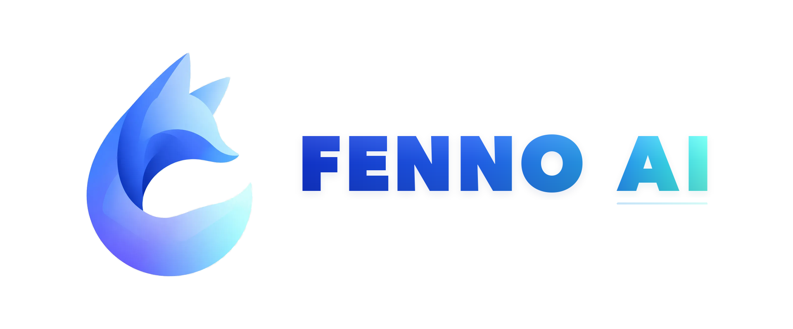
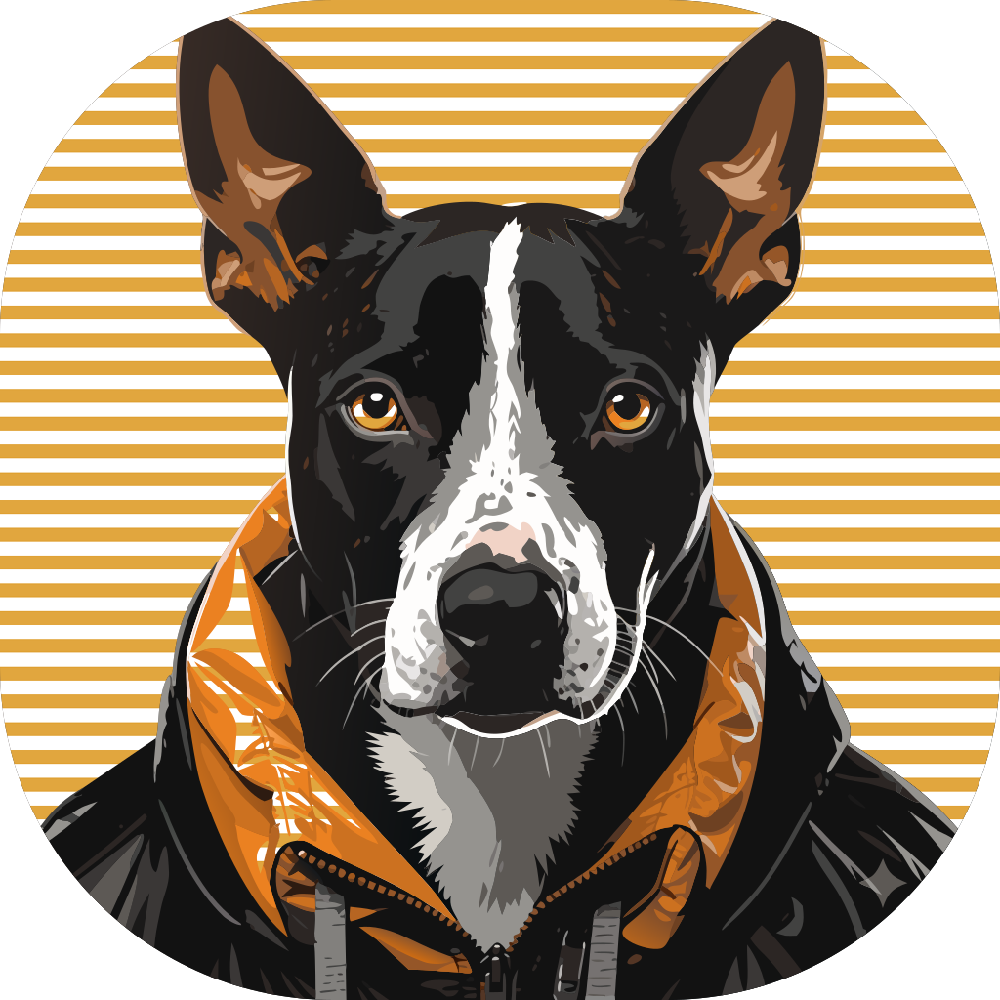

<p align="center">
  
</p>

<p align="center">
  <a href="https://github.com/chenhg5/cc-connect/actions/workflows/ci.yml">
    
  </a>
  <a href="https://github.com/chenhg5/cc-connect/releases">
    
  </a>
  <a href="https://www.npmjs.com/package/cc-connect">
    
  </a>
  <a href="https://github.com/chenhg5/cc-connect/blob/main/LICENSE">
    
  </a>
  <a href="https://goreportcard.com/report/github.com/chenhg5/cc-connect">
    
  </a>
</p>

<p align="center">
  <a href="https://discord.gg/kHpwgaM4kq">
    
  </a>
  <a href="https://t.me/+odGNDhCjbjdmMmZl">
    
  </a>
</p>

<p align="center">
  <a href="./README.md">English</a> | <a href="./README.zh-CN.md">中文</a>
</p>

<p align="center">
  <a href="https://trendshift.io/repositories/23266" target="_blank">
    
  </a>
</p>


## ❤️ 赞助

> 想在这里展示？联系：chg80333@gmail.com | 微信：mongorz

<details open>
<summary>赞助商</summary>

[](https://platform.minimaxi.com/subscribe/token-plan?code=HAvthxk1tT&source=link)

MiniMax M3 突破 Coding 与 Agentic AI 前沿，基于 MiniMax Sparse Attention 支持 1M 超长上下文，并从零原生支持多模态。在 SWE-Bench Pro (59.0)、Terminal Bench 2.1 (66.0)、VIBE V2 (60.1)、SVG-Bench (63.7)、KernelBench Hard (28.8)、BrowseComp (83.5)、GDPval rubrics (74.7)、Banker ToolBench (76.1)、MCP Atlas (74.2)、OSWorld-verified (70.0) 等多项基准中领先业界。Mini 价格 Max 性能，Token Plan 助你 Build / Learn / Ship。

[点击此处](https://platform.minimaxi.com/subscribe/token-plan?code=HAvthxk1tT&source=link)享 MiniMax Token Plan 专属 88 折优惠 + cc-connect 用户专属代金券！

---

<table>
<tr>
<td width="150"><a href="https://apinebula.com/UrO0q1"></a></td>
<td>感谢 APINEBULA 赞助本项目！APINEBULA 是银河录像局旗下的企业级 AI 聚合平台，背靠大平台资源，面向开发者、团队与企业用户提供稳定、高性价比的大模型 API 接入服务。平台聚合 Claude、GPT、Gemini等主流满血模型，一个接口，接入全球顶尖AI大模型，各大模型价格低至 1 折起，支持企业级高并发、正式合同、对公打款与开票服务，适合 AI 编程、Agent 开发、业务系统集成等多种场景！使用此链接注册并在充值时填写"ccconnect"优惠码可享九折优惠！</td>
</tr>

<tr>
<td width="150"><a href="https://s.qiniu.com/aUbueu"></a></td>
<td>感谢 <a href="https://s.qiniu.com/aUbueu">七牛云 AI</a> 赞助本项目！七牛云（02567.HK）旗下企业级 MaaS 平台，一站式调用全球 150+ 主流模型，兼容全球主流模型厂商协议，覆盖文本、图像、音频、视频、文件处理等全模态处理能力，服务超过 169 万企业及开发者用户。专属福利：企业用户免费领 1200万 Token，邀请好友最高得百亿 Token。</td>
</tr>

<tr>
<td width="150"><a href="https://api.fenno.ai/register?redirect=/purchase?tab=subscription%26group=16&aff=C7KG6WBS7CQJ"></a></td>
<td>感谢 Fenno.ai 赞助本项目！Fenno.ai 是一家稳定、高效的 API 中转服务商，目前主要提供 Codex 中转服务，兼容 OpenAI 及 Anthropic 协议，可灵活接入 Codex、Claude Code、OpenCode 等主流编程工具，可稳定支撑千亿 Token/日的企业级调用需求，支持国内及海外主体公对公结算、开票。Fenno.ai 为 CC-Connect 的用户提供了专属福利：通过 <a href="https://api.fenno.ai/register?redirect=/purchase?tab=subscription%26group=16&aff=C7KG6WBS7CQJ">此链接</a> 即可订阅 9.9 元/150 刀额度的超值 Coding Plan，邀请好友最高可享 20% 奖励，多邀多得！</td>
</tr>

<tr>
<td width="150"><a href="https://aigocode.com/invite/CYY3C85C"></a></td>
<td>感谢 AIGoCode 对本项目的赞助！AIGoCode 是集 Claude Code、Codex、最新 Gemini 模型于一体的一站式平台，提供稳定高效、高性价比的 AI 编码服务。灵活订阅方案、零封号风险、无需 VPN 直连、响应速度极快。通过 <a href="https://aigocode.com/invite/CYY3C85C">此链接</a> 注册，首充额外获得 10% 赠送额度！</td>
</tr>

<tr>
<td width="150"><a href="https://www.dmxapi.cn/register?aff=NDln"></a></td>
<td>感谢 DMXAPI（大模型API）赞助本项目！DMXAPI，一个 Key 用全球大模型。为 200+ 企业用户提供全球大模型 API 服务。充值即开票、当天开票、并发不限制、1元起充、7x24 在线技术辅导。GPT/Claude/Gemini 全部 6.8 折，国内模型 5~8 折，Claude Code 专属模型 3.4 折进行中！<a href="https://www.dmxapi.cn/register?aff=NDln">点击这里注册</a></td>
</tr>

<tr>
<td width="150"><a href="https://apikey.fun/register?aff=cc_connect"></a></td>
<td>感谢 APIKEY.FUN 赞助本项目！APIKEY.FUN 是一家专业的企业级 AI 中转站，致力于为企业和个人开发者提供稳定、高效、低成本的 AI 模型 API 接入服务。平台支持 Claude、OpenAI、Gemini 等主流热门模型，价格低至官方原价的 7%。通过<a href="https://apikey.fun/register?aff=cc_connect">此链接</a>注册，还可享受最高充值永久 95 折专属优惠！</td>
</tr>

<tr>
<td width="150"><a href="https://www.shengsuanyun.com/?from=CH_67XCLZGS"></a></td>
<td>感谢胜算云赞助了本项目！胜算云是专为 AI Native Teams 服务的超级工厂，工业级 AI 任务并行执行平台，模型商城集采直供聚合接入了 Claude、Chatgpt、Gemini 等海内外 LLM 及图片视频多媒体模型算力，绝无逆向掺水、全站模型 SLA 可用性高达 99.7%、<a href="https://watch.shengsuanyun.com/status/shengsuanyun">监测接口</a>日常全绿。更有企业级专属定制网关，实现团队精细化成本与权限管控，智能路由+安全防护+BYOK 企业自带密钥托管。平台按量及 tokens plan（即将上线）计费，可开票，使用<a href="https://www.shengsuanyun.com/?from=CH_67XCLZGS">此链接</a>注册新用户可获 10 元模力及首充 10% 赠送。</td>
</tr>

<tr>
<td width="150"><a href="https://visioncoder.cn"></a></td>
<td>感谢 VisionCoder 对本项目的支持。<a href="https://visioncoder.cn">VisionCoder 开发平台</a> 是一个可靠高效的 API 中继服务提供商，提供 Claude Code、Codex、Gemini 等主流 AI 模型，帮助开发者和团队更轻松地集成 AI 功能，提升工作效率。此外，VisionCoder 还提供 <strong>Claude Max 200</strong> 与 <strong>GPT Pro 200</strong> <strong>高级成品号</strong>的独家售卖渠道，助力体验全网顶配 AI 的算力与体验。</td>
</tr>

<tr>
<td width="150"><a href="https://runapi.co/register?aff=4BXa"></a></td>
<td>感谢 RunAPI 对本项目的赞助！RunAPI 是高效稳定的API OpenRouter平替平台，一个 API Key 即可访问 OpenAI、Claude、Gemini、DeepSeek、Grok 等 150+ 主流模型，低至 1 折，极其稳定，可以无缝兼容 Claude Code、OpenClaw 等工具。RunAPI 为 cc-connect的用户提供专属福利：注册联系管理员即可领取￥7的免费额度</td>
</tr>

<tr>
<td width="150"><a href="https://camel.kr777.top/register?aff=V2z8"></a></td>
<td>感谢 CaMeL 对本项目的赞助！携手各大科研院所、超算中心深度合作，自研高稳高效缓存调度方案。CC-Connect专享新人注册认证即送$10！通过 <a href="https://camel.kr777.top/register?aff=V2z8">此链接</a> 注册。</td>
</tr>

<tr>
<td width="150"><a href="https://unity2.ai/register?source=ccconnect"></a></td>
<td>感谢 Unity2.ai 赞助了本项目！Unity2.ai 是面向个人开发者、团队和企业的高性能 AI 模型 API 中转平台，长期服务国内头部企业，日均承载超 300 亿 token 调用，支持 5000 RPM 级高并发。支持余额计费、首充赠额、组合订阅、企业开票和专属对接。通过 <a href="https://unity2.ai/register?source=ccconnect">此链接</a> 注册可领取 $2 余额，加入官方群再送 $10 余额，最高可领 $12 免费额度。</td>
</tr>

<tr>
<td width="150"><a href="https://ergouapi.com/r/gh-cc-connect"></a></td>
<td>感谢 二狗 API (Ergou API) 赞助本项目!接入二狗,稳如老狗。二狗 API 中转站,全站 0.1x~0.2x 超低倍率,提供 Claude/GPT/Gemini 等多个国内外 100% 纯血大模型接口,顶级 IPLC 线路 + 住宅双 ISP 冗余,确保全国范围稳定低延迟访问。欢迎各位开发者、工作室 <a href="https://ergouapi.com/r/gh-cc-connect">注册使用</a>。</td>
</tr>

<tr>
<td width="150"><a href="https://cc.anyroute.io/register?aff=CR455DSQSKEV"></a></td>
<td>感谢 AnyRoute.io 对本项目的赞助！AnyRoute.io 是集 Claude Code、Codex 最新模型于一体、可靠稳定高效的 API 中转站，价格透明，最低低至官方 0.7 折，支持开票和企业高并发。通过 <a href="https://cc.anyroute.io/register?aff=CR455DSQSKEV">此链接</a> 注册即可开始使用。</td>
</tr>

<tr>
<td width="150"><a href="https://aicanapi.com/register?aff=rIEy"></a></td>
<td>感谢 aicanapi.com 对本项目的赞助！艾可API致力于为企业与开发者提供高性能、低延迟、可高并发承载的API接口服务。Claude Code 模型最低可达 1.6 折，其余模型普遍可享官方 2 折优惠，豆包 Seedance 2 真人生成服务支持免排队调用。选择艾可API，让企业级AI接口服务更简单、更高效、更具性价比。通过 <a href="https://aicanapi.com/register?aff=rIEy">此链接</a> 注册即可开始使用。</td>
</tr>

<tr>
<td width="150"><a href="https://pateway.ai/?ch=2qn568&aff=DRA4VUFS"></a></td>
<td>感谢 Pateway 对本项目的赞助！PatewayAI 是面向重度 AI 开发者、专注官方直连的高品质模型 API 中转服务商。提供 Claude 全系列与 Codex 系列模型，100% 官方源直供，不掺假不注水。计费透明，Token 级账单可逐笔核验。支持企业级高并发，可签订正式合同并开具发票。通过 <a href="https://pateway.ai/?ch=2qn568&aff=DRA4VUFS">此链接</a> 注册即送 $3 试用额度，充值低至 6 折，邀请好友双向赠送，邀请奖励可达 $150！</td>
</tr>

<tr>
<td width="150"><a href="https://cy.10dianai.com/register?aff=3FQn"></a></td>
<td>感谢 10点AI 对本项目的赞助！10dian-AI企业台是面向开发者与企业的 AI API 中转平台，聚合 GPT、Claude、Gemini、DeepSeek 等主流模型。针对生产环境专项优化，支持高并发稳定运行，有效规避接口抖动与超时问题。价格亲民性价比高、接口稳定不掉线、官方保真不参水。通过 <a href="https://cy.10dianai.com/register?aff=3FQn">此链接</a> 注册即送 ¥5 余额！</td>
</tr>

<tr>
<td width="150"><a href="https://cloud.siliconflow.cn/i/650Yh2Z7"></a></td>
<td>感谢 SiliconFlow 对本项目的支持！SiliconFlow 是高性能 AI 基础设施和模型 API 平台，提供语言、语音、图片、视频等多种模型的快速可靠访问。按量计费，多模态模型支持，高速推理，企业级稳定性，帮助开发者和团队更高效地构建和扩展 AI 应用。通过 <a href="https://cloud.siliconflow.cn/i/650Yh2Z7">此链接</a> 注册并完成实名认证，即可获得 ¥20  bonus credits！</td>
</tr>


<tr>
<td width="150"><a href="https://passport.compshare.cn/register?referral_code=H65IOClRGu5CM7nn5ykfad&ytag=GPU_YY_YX_git_cc-connect"></a></td>
<td>感谢优云智算赞助了本项目！优云智算是UCloud旗下AI云平台，提供稳定、全面的国内外模型API，仅一个key即可调用。主打包月、按次的高性价比国模Coding Plan套餐，同时提供官转稳定海外模型。支持接入 Claude Code、Codex 及 API 调用。支持企业高并发、7*24技术支持、自助开票。通过 <a href="https://passport.compshare.cn/register?referral_code=H65IOClRGu5CM7nn5ykfad&ytag=GPU_YY_YX_git_cc-connect">此链接</a> 注册的用户，可得免费5元平台体验金！</td>
</tr>

<tr>
<td width="150"><a href="https://dragoncode.codes/register?ref=23ZELCPX"></a></td>
<td>感谢 DragonCode 对本项目的支持。DragonCode 为 cc-connect 用户准备了专属福利：通过 <a href="https://dragoncode.codes/register?ref=23ZELCPX">此链接</a> 注册即可开始体验。</td>
</tr>


<tr>
<td width="150"><a href="https://code0.ai/register?aff=5cGO"></a></td>
<td>感谢 Code0 对本项目的赞助！Code0 是面向中国开发者的 AI 模型聚合 API 中转服务，统一兼容 OpenAI / Anthropic / Gemini 三种协议格式，一个 Key 即可调用全量主流模型，稳定适配 Claude Code、Codex、Gemini CLI、cc-connect 等各类 Agent 工具。固定汇率计费：充值 1.5 元人民币 = 1 美元 API 额度，价格透明、国内直连、开箱即用。通过 <a href="https://code0.ai/register?aff=5cGO">此链接</a> 注册。</td>
</tr>

<tr>
<td width="150"><a href="https://console.claudeapi.com/register?aff=GDbA"></a></td>
<td>感谢 claudeapi.com 对本项目的赞助！claudeapi 是面向中高端用户的高质量直连 Claude 服务，完整接入 Anthropic 官方第一方 Keys 和 AWS Bedrock 官方渠道——无逆向工程、无智力降级、无拼接。完整保留 Opus / Sonnet / Haiku 的官方能力、长上下文和 Tool Calling 性能。专为 Claude Code 重度用户、Agent 开发者和企业团队设计，开箱即用、企业级稳定。支持开票和团队入驻。通过 <a href="https://console.claudeapi.com/register?aff=GDbA">此链接</a> 注册。</td>
</tr>
</table>

</details>

---

<br>

<p align="center">
  <b>在任何聊天工具里，远程操控你的本地 AI Agent。随时随地，随心所欲。</b>
</p>

<p align="center">
  cc-connect 把运行在你机器上的 AI Agent 桥接到你日常使用的即时通讯工具。<br/>
  代码审查、资料研究、自动化任务、数据分析 —— 只要 AI Agent 能做的事，<br/>
  都能通过手机、平板或任何有聊天应用的设备来完成。
</p>

<p align="center">
  
</p>


## 🆕 v1.3.3 更新了什么

1.3.3 系列首个正式版 —— 把 beta.1 → beta.5（自 v1.3.2 起约 235 个 PR）与 7 个 post-beta 修复一并稳定下来。亮点：

- **新增 Agent** — Devin CLI、Google Antigravity (`agy`)、GitHub Copilot CLI 均为一等公民 agent (#672, #1123, #865)；Cursor / OpenCode / Qoder / Kimi / Pi 覆盖大幅加强。
- **平台能力扩展** — QQ (OneBot) 文件收发 (#323)、QQ Bot 内联键盘 (#1131)、企业微信 WebSocket `SendFile` (#1199)、飞书原生音视频附件 (#1202)、Slack Assistant API (#844)、MAX webhook 投递模式 (#818)、钉钉 @mention / richText / 图片 / 文件入站 (#1188, #828, #1357)、微博私信能力扩充、WPS 协作（金山协作）。
- **长任务保护** — 新增 `max_turn_time_mins` 绝对墙钟上限，软停 + 强杀 + 下一条消息自动 `--resume`，避免长跑的 bash / test 命令把 session 永久锁住 (#1091)。
- **新核心命令** — `/timer`（一次性延时任务）、`/cancel`（中断当前 turn）、`/ps`（替代 `/btw`，`/btw` 保留为别名）、`cron add --silent`、agent 主动 TTS 输出。
- **多用户 / 权限** — 可选「回复未授权 IM 发件人」、`@Bot/permit` ≡ `/permit` 关键字匹配、Bridge 启用时必须配置 token。
- **Provider 生态** — 新增 NekoCode、VisionCoder、AIHubMix、MiniMax M3 预设；Claude Code 1M-context Opus + `append_system_prompt` + PermissionRequest hooks；Codex `request_user_input` app-server 事件；可配置 `shell` 与 shell profile。
- **可观测性** — Blackbox 测试框架（P0/P1/P2 + config-switch 矩阵）、CUJ 测试框架、codex/opencode/kimi 的 provider-resume 回归套件、Pi 在 reply footer 输出 context 用量。

⚠️ **行为变更（可能需要改配置）**：Telegram / Discord `progress_style` 默认值改为 `compact`（设回 `legacy` 可还原）；QQ Bot 默认 `intents` 现在包含 `INTERACTION_CREATE`，若自定义 `intents` 需手动包含 `1<<26`；钉钉 `msgtype=file` 入站现在送达 agent；引擎权限关键字容忍 @mention；`reset_on_idle_mins` 默认值改为 30 分钟；Bridge 未配置 token 时拒绝启动。完整主题汇总见 `changelogs/v1.3.3.md`。

无任何破坏性变更（No breaking changes）。从任意 v1.3.3-beta.\* 升级到 v1.3.3 是 fix-only 的小升级。


## 🧩 平台能力一览

内置各渠道在 cc-connect 里的大致能力对照，方便快速对比。

**图例**

| 符号 | 含义 |
|------|------|
| ✅ | **稳定版** cc-connect + 常规配置下可用 |
| ⚠️ | 部分支持、需额外配置（如语音/STT）或受厂商接口 / 应用类型限制 |
| ❌ | 不支持或实际不可用 |

† **QQ（NapCat / OneBot）** — 非官方自建桥接，体验依赖你的 NapCat 与网络环境。

| 能力 | 飞书 | WPS 协作 | 钉钉 | Telegram | Slack | Discord | LINE | 企业微信 | 微博 | **微信个人号**<br>（ilink） | QQ† | QQ 官方机器人 | Matrix |
|------|:----:|:--------:|:----:|:--------:|:-----:|:-------:|:----:|:--------:|:----:|:--------------------------:|:---:|:------------:|:-----:|
| 文本与斜杠命令 | ✅ | ✅ | ✅ | ✅ | ✅ | ✅ | ✅ | ✅ | ✅ | ✅ | ✅ | ✅ | ✅ |
| Markdown / 卡片 | ✅ | ✅ | ✅ | ✅ | ✅ | ✅ | ⚠️ | ⚠️ | ❌ | ✅ | ✅ | ✅ | ⚠️ |
| 流式 / 分片回复 | ✅ | ✅ | ✅ | ✅ | ✅ | ✅ | ✅ | ✅ | ✅ | ✅ | ✅ | ✅ | ✅ |
| 图片与文件 | ✅ | ❌ | ✅ | ✅ | ✅ | ✅ | ⚠️ | ✅ | ❌ | ✅ | ✅ | ✅ | ✅ |
| 语音 / STT / TTS | ⚠️ | ❌ | ⚠️ | ✅ | ⚠️ | ⚠️ | ❌ | ⚠️ | ❌ | ✅ | ⚠️ | ⚠️ | ❌ |
| 私聊 | ✅ | ✅ | ✅ | ✅ | ✅ | ✅ | ✅ | ✅ | ✅ | ✅ | ✅ | ✅ | ✅ |
| 群聊 / 频道 | ✅ | ✅ | ✅ | ✅ | ✅ | ✅ | ⚠️ | ✅ | ❌ | ✅ | ✅ | ✅ | ✅ |

> **企业微信：** Webhook 模式需要**公网 URL**；长连接等模式多数**不需要**。  
> **语音行：** 多数平台要在 `config.toml` 里配置 `[speech]` / TTS 等，表中为经验性归纳。  
> 分平台接入步骤见下文 [平台接入指南](#-平台接入指南)。


## ✨ 为什么选择 cc-connect？

### 🤖 通用 Agent 支持
**10+ 大 AI Agent** — Claude Code、Codex、Cursor Agent、Kimi CLI、Qoder CLI、Gemini CLI、OpenCode、iFlow CLI、Pi、Devin、Copilot，还可通过 [Agent Client Protocol (ACP)](https://agentclientprotocol.com/get-started/agents) 接入更多 Agent。按需选用，或同时使用全部。

### 📱 平台灵活性
**13 大聊天平台** — 飞书、WPS 协作、钉钉、Slack、Telegram、Discord、企业微信、微博、LINE、QQ、QQ 官方机器人、Matrix，以及 **微信个人号（ilink）**。大部分平台**无需公网 IP**。

### 🔄 多 Agent 编排
**多机器人中继** — 在群聊中绑定多个机器人，让它们相互协作。问 Claude，再听 Gemini 的见解 — 同一个对话搞定。

### 🎮 完整的聊天控制
**聊天即控制** — 切换模型 (`/model`)、切换推理强度 (`/reasoning`)、切换权限模式 (`/mode`)、管理会话，全部通过斜杠命令完成。

**聊天切换工作目录** — 使用 `/dir <路径>` 切换下一次会话启动目录（`/cd <路径>` 为兼容别名），并支持 `/dir <序号>` / `/dir -` 快速在历史目录间跳转。

### 🧠 持久化记忆
**Agent 记忆** — 在聊天中直接读写 Agent 指令文件 (`/memory`)，无需回到终端。

### ⏰ 智能定时任务
**定时任务** — 自然语言创建 cron 任务。"每天早上6点总结 GitHub trending" 即刻生效。

### 🎤 多模态支持
**语音 & 图片** — 发语音或截图，cc-connect 自动处理 STT/TTS 和多模态转发。

### 📦 多项目架构
**多项目管理** — 一个进程同时管理多个项目，各自独立的 Agent + 平台组合。

### 🌍 多语言界面
**5 种语言** — 原生支持英语、中文（简体/繁体）、日语和西班牙语。内置 i18n 让每个人都能得心应手。


<p align="center">
  
  
  
</p>
<p align="center">
  <em>左：飞书 &nbsp;|&nbsp; Telegram &nbsp;|&nbsp; 右：微信</em>
</p>


## 🚀 快速开始

### 🤖 通过 AI Agent 安装配置（推荐）

> **最简单的方式** — 把这段话发给 Claude Code 或其他 AI 编码 Agent，它会帮你完成整个安装和配置过程：

```bash
请参考 https://raw.githubusercontent.com/chenhg5/cc-connect/refs/heads/main/INSTALL.md 帮我安装和配置 cc-connect
```


### 📦 手动安装

**通过 npm：**

```bash
# npm install -g cc-connect
```

**通过 Homebrew（macOS / Linux）：**

```bash
brew install cc-connect
```

**从 [GitHub Releases](https://github.com/chenhg5/cc-connect/releases) 下载：**

```bash
# Linux amd64 - 稳定版
curl -L -o cc-connect https://github.com/chenhg5/cc-connect/releases/latest/download/cc-connect-linux-amd64
chmod +x cc-connect
sudo mv cc-connect /usr/local/bin/

```

**从源码编译（需要 Go 1.22+）：**

```bash
git clone https://github.com/chenhg5/cc-connect.git
cd cc-connect
make build
```


### ⚙️ 配置

> **💡 推荐使用 Web UI 配置** — 安装完成后，运行 `cc-connect web` 配置 Web 管理后台并在浏览器中打开。可以可视化创建项目、添加平台、管理服务商、直接和 Agent 聊天，无需手动编辑 TOML 文件。**注意：** `cc-connect web` 仅用于配置和打开浏览器，并不会启动 cc-connect 服务本身，你仍需单独运行 `cc-connect` 来启动。

如果你更喜欢手动配置：

```bash
mkdir -p ~/.cc-connect
cp config.example.toml ~/.cc-connect/config.toml
vim ~/.cc-connect/config.toml
```

在项目配置里设置 `admin_from = "alice,bob"` 后，只有这些用户 ID 才能执行 `/dir`、`/shell` 等特权命令。
执行 `/dir reset` 时，cc-connect 会恢复配置中的 `work_dir`，并清除保存在 `data_dir/projects/<project>.state.json` 里的目录覆盖状态。


### ▶️ 运行

```bash
./cc-connect
```


### 🔄 升级

```bash
# npm
npm install -g cc-connect

# Homebrew
brew upgrade cc-connect

# 二进制自更新
cc-connect update           # 稳定版
cc-connect update --pre     # 含预发布版本
```


## 📊 支持状态

| 组件 | 类型 | 状态 |
|------|------|------|
| Agent | Claude Code | ✅ 已支持 |
| Agent | Codex (OpenAI) | ✅ 已支持 |
| Agent | Cursor Agent | ✅ 已支持 |
| Agent | Gemini CLI (Google) | ✅ 已支持 |
| Agent | Qoder CLI | ✅ 已支持 |
| Agent | OpenCode (Crush) | ✅ 已支持 |
| Agent | iFlow CLI | ✅ 已支持 |
| Agent | Kimi CLI (Moonshot) | ✅ 已支持 |
| Agent | Pi (Cursor Background Agent) | ✅ 已支持 |
| Agent | Copilot (GitHub) | ✅ 已支持 |
| Agent | ACP (Agent Client Protocol) | ✅ 支持任何 [ACP 兼容 Agent](https://agentclientprotocol.com/get-started/agents) |
| Agent | Devin (Cognition) | ✅ 已支持（通过 ACP）|
| Agent | Goose (Block) | 🔜 计划中 |
| Agent | Aider | 🔜 计划中 |
| Platform | 飞书 (Lark) | ✅ WebSocket — 无需公网 IP |
| Platform | 钉钉 | ✅ Stream — 无需公网 IP |
| Platform | WPS 协作 | ✅ WebSocket — 无需公网 IP |
| Platform | Telegram | ✅ Long Polling — 无需公网 IP |
| Platform | Slack | ✅ Socket Mode — 无需公网 IP |
| Platform | Discord | ✅ Gateway — 无需公网 IP |
| Platform | 微博 | ✅ WebSocket — 无需公网 IP |
| Platform | LINE | ✅ Webhook — 需要公网 URL |
| Platform | 企业微信 | ✅ WebSocket / Webhook |
| Platform | 微信个人号（ilink） | ✅— HTTP 长轮询 — 无需公网 IP |
| Platform | QQ (NapCat/OneBot) | ✅ WebSocket |
| Platform | QQ 官方机器人 | ✅ WebSocket — 无需公网 IP |
| Platform | Matrix | ✅ Long Polling (/sync) — 无需公网 IP |


## 📖 平台接入指南

| 平台 | 指南 | 连接方式 | 需要公网 IP? |
|------|------|---------|-------------|
| 飞书 (Lark) | [docs/feishu.md](docs/feishu.md) | WebSocket | 不需要 |
| 钉钉 | [docs/dingtalk.md](docs/dingtalk.md) | Stream | 不需要 |
| WPS 协作 | [docs/wps-xiezuo.md](docs/wps-xiezuo.md) | WebSocket | 不需要 |
| Telegram | [docs/telegram.md](docs/telegram.md) | Long Polling | 不需要 |
| Slack | [docs/slack.md](docs/slack.md) | Socket Mode | 不需要 |
| Discord | [docs/discord.md](docs/discord.md) | Gateway | 不需要 |
| 微博 | [docs/weibo.md](docs/weibo.md) | WebSocket | 不需要 |
| 企业微信 | [docs/wecom.md](docs/wecom.md) | WebSocket / Webhook | 不需要 (WS) / 需要 (Webhook) |
| 微信个人号（ilink） | [docs/weixin.md](docs/weixin.md) | HTTP 长轮询（ilink） | 不需要 |
| QQ / QQ 机器人 | [docs/qq.md](docs/qq.md) | WebSocket | 不需要 |
| Matrix | [docs/matrix.md](docs/matrix.md) | /sync（长轮询） | 不需要 |


## 🎯 核心功能

### 💬 会话管理

```
/new [名称]            创建新会话
/list                  列出所有会话
/switch <id>           切换会话
/current               查看当前会话
/dir [路径|reset]      查看、切换或重置工作目录
```

项目配置也可以开启“长时间空闲后自动切到新会话”：

```toml
[[projects]]
reset_on_idle_mins = 60
```


### 🛡️ 系统用户隔离 (`run_as_user`)

在 Linux/macOS 上，项目可以用另一个 Unix 用户身份启动 Agent，从而在操作系统层面实现文件系统隔离。目前 Claude Code 已支持。

```toml
[[projects]]
name = "claude-sandboxed"
run_as_user = "partseeker-coder"
run_as_env = ["PGSSLROOTCERT"]
```

目标用户需要：supervisor 对其配置免密 sudo、自身不拥有 sudo、对 `work_dir` 有读写权限、拥有自己的 `~/.claude/settings.json`。
如果你通过 `claude.ai` OAuth 认证，请将目标用户的 `~/.claude/.credentials.json` 软链接到 supervisor 的副本以保持 token 同步 —— 详见[环境传播清单](./docs/usage.md#environment-propagation-what-moves-into-the-target-users-home)。
完整设置说明见 [`docs/usage.md`](./docs/usage.md#running-agents-as-a-different-unix-user-run_as_user)。

启动 cc-connect 之前，可用以下命令审核配置：

```bash
cc-connect doctor user-isolation
```

该命令会执行三项前置检查和一次隔离探测，报告目标用户能/不能读取的内容。如果任一检查失败或探测到跨用户泄漏，cc-connect 将拒绝启动。

---

### 🔐 权限模式

```
/mode             查看可用模式
/mode yolo        # 自动批准所有工具
/mode default     # 每次工具调用前询问
```


### 🔄 Provider 管理

```
/provider list              列出 Provider
/provider switch <名称>     运行时切换 API Provider
```


### 🤖 模型选择

```
/model                      列出可用模型（格式：alias - model）
/model switch <alias>       按别名切换模型
```


### 📂 工作目录

```
/dir                         查看当前工作目录与历史
/dir <路径>                  切换到指定目录（相对或绝对路径）
/dir <序号>                  按历史序号切换
/dir -                       返回上一个目录
/cd <路径>                   `/dir <路径>` 的兼容别名
```


### ⏰ 定时任务

```bash
/cron add 0 6 * * * 帮我总结 GitHub trending
```

### 📎 Agent 回传图片和文件

当 Agent 在本地生成了截图、图表、PDF、日志包等文件时，可以主动把附件发回当前聊天。

首版支持：
- 飞书
- Telegram

如果当前 Agent 不是原生注入 system prompt 的类型，升级后请先在聊天里执行一次：

```text
/bind setup
```

或：

```text
/cron setup
```

这样会把最新的 cc-connect 指令写入项目记忆文件，Agent 才会知道如何回传附件。

你也可以在 `config.toml` 里全局控制这项能力：

```toml
attachment_send = "on"  # 默认 "on"；设为 "off" 会禁用图片/文件回传
```

这个开关与 agent 的 `/mode` 独立，只控制 `cc-connect send --image/--file` 这条附件回传路径。语音回传走 TTS 配置。

回传方式：

```bash
cc-connect send --image /absolute/path/to/chart.png
cc-connect send --file /absolute/path/to/report.pdf
cc-connect send --file /absolute/path/to/report.pdf --image /absolute/path/to/chart.png
cc-connect send --tts "你好"
```

要点：
- 使用绝对路径最稳妥。
- `--image` 和 `--file` 都可以重复传多个。
- `--tts` 用当前 TTS provider 合成并发送语音，适合用户自然要求“发语音”的场景。
- `attachment_send = "off"` 只会关闭附件回传，普通文本回复仍然正常。
- 单个附件默认上限 50 MiB；可用 `max_attachment_size_mb` 配置（或环境变量 `CC_MAX_ATTACHMENT_SIZE_MB`，同样单位 MiB）。
- 这个命令是给“生成后的附件回传”用的，不是给普通文本回复用的。

📖 **完整文档：** [docs/usage.zh-CN.md](docs/usage.zh-CN.md)


## 📚 文档

- [使用指南](docs/usage.zh-CN.md) — 完整功能文档
- [INSTALL.md](INSTALL.md) — AI Agent 友好的安装指南
- [config.example.toml](config.example.toml) — 配置模板
- [CONTRIBUTING.md](CONTRIBUTING.md) — Issue / PR 提交流程与贡献说明


## 👥 社区

- [Discord](https://discord.gg/kHpwgaM4kq)
- [Telegram](https://t.me/+odGNDhCjbjdmMmZl)


## ☕ 支持项目

如果 cc-connect 对你有帮助，请考虑请我们喝杯咖啡！你的支持帮助我们：

- 🛠️ 维护和改进项目
- 📚 编写更好的文档和教程
- 🐛 更快修复 bug 和添加新功能
- ☕ 让开发者保持精力充沛

### 捐赠方式

**Buy Me a Coffee**：[https://buymeacoffee.com/cg33](https://buymeacoffee.com/cg33)

**微信支付 / 支付宝**：

| 微信支付 | 支付宝 |
|:----------:|:------:|
|  |  |

### 感谢捐赠者！🎉

感谢每一位支持这个项目的朋友。捐赠时留言你的 GitHub 用户名，我们会在这里展示！

<!-- 捐赠者名单 -->
| 头像 | GitHub 用户名 | 日期 |
|------|-----------------|------|
|  | [@thx0701](https://github.com/thx0701) | 2026-04-29 |


## 🤝 商业合作

我们接受以下商业合作：

- **企业定制**：为企业定制内部 AI 工具入口（飞书、钉钉、企业微信、Slack 等）
- **技术咨询**：AI agent 集成方案设计与架构咨询
- **外包项目**：AI 相关系统开发

**联系方式**：**邮箱**：chg80333@gmail.com | **微信**：mongorz | [Telegram](https://t.me/+odGNDhCjbjdmMmZl) | [Discord](https://discord.gg/kHpwgaM4kq)


## 🙏 贡献者

<a href="https://github.com/chenhg5/cc-connect/graphs/contributors">
  
</a>


## ⭐ Star History

<a href="https://www.star-history.com/#chenhg5/cc-connect&Date">
 <picture>
   <source media="(prefers-color-scheme: dark)" srcset="https://api.star-history.com/svg?repos=chenhg5/cc-connect&type=Date&theme=dark" />
   <source media="(prefers-color-scheme: light)" srcset="https://api.star-history.com/svg?repos=chenhg5/cc-connect&type=Date" />
   
 </picture>
</a>


## 📄 License

MIT License


<p align="center">
  <sub>由 cc-connect 社区用 ❤️ 构建</sub>
</p>
